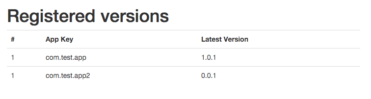
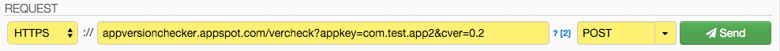
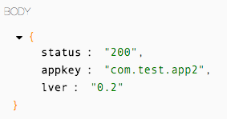
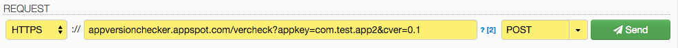
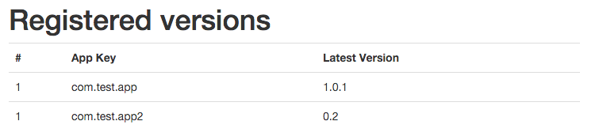

## AppVersionChecker

최신 버전을 확인하는 버전 체크 서버<br/>
google app engine 에서 동작함

사이트 가기 : [appversionchecker.appspot.com](https://appversionchecker.appspot.com/)

### Design

1. (어플) 어플에서 package ID (appkey) 와 현재 버전 (cver) 을 가지고 서버에 요청한다.
2. (서버) 어플에서 요청된 appkey가 있으면 cver와 저장된 값을 비교하고<br/>
	2-1. 서버에 저장된 버전이 더 높으면 서버 버전을 알려준다.<br/>
    2-2. 어플 버전이 더 높으면 서버에 저장하고 어플 버전을 돌려준다.
3. (어플) Request는 HTTP POST 로 요청한다.
4. (서버) Response는 JSON 으로 반환한다.
5. (서버) 브라우저에서 접근하는 경우 등록된 어플과 버전의 목록을 보여준다.

~~(시퀀스 다이어그램으로 그리..)~~

### Source

/vercheck 로 접근하는 경우 CheckerServet 을 실행한다.

```xml
<servlet>
	<servlet-name>vercheck</servlet-name>
	<servlet-class>com.iamchiwon.appversionchecker.CheckerServlet</servlet-class>
</servlet>
<servlet-mapping>
	<servlet-name>vercheck</servlet-name>
	<url-pattern>/vercheck</url-pattern>
</servlet-mapping>
```

POST 요청에 대해서만 받아들이고
GET 요청은 versions 로 넘긴다. (전체 목록을 보여주는 웹페이지 : version.jsp)
Database 는 Google App Engine 에서 제공하는 Datastore 를 사용한다.

```java
public class CheckerServlet extends HttpServlet {

	private static final long serialVersionUID = 5287674749489451645L;

	@Override
	protected void doGet(HttpServletRequest req, HttpServletResponse resp) throws IOException {
		resp.sendRedirect("/versions");
	}

	@Override
	protected void doPost(HttpServletRequest req, HttpServletResponse resp) throws IOException {
		String appkey = req.getParameter("appkey");
		String currentVersion = req.getParameter("cver");

		resp.setContentType("application/json");

		JSONObject json = new JSONObject();

		if (appkey == null) {
			json.put("status", "404");
		} else {
			json.put("appkey", appkey);
			String latestVersion = getLatestVersion(appkey, currentVersion);
			if (latestVersion == null) {
				json.put("message", "parameter 'cver' not found");
				json.put("status", "400");
			} else {
				json.put("lver", latestVersion);
				json.put("status", "200");
			}
		}

		resp.getWriter().println(json.toString());

	}

	public String getLatestVersion(String appkey, String current) {
		Key<AppVersion> courseKey = Key.create(AppVersion.class, appkey);
		AppVersion app = ObjectifyService.ofy().load().type(AppVersion.class).filterKey(courseKey).first().now();
		String latest = app == null ? null : app.version;

		if (latest == null && current == null)
			return null;

		if (current == null)
			return latest;

		if (latest == null || latest.compareTo(current) < 0) {
			latest = current;

			AppVersion newApp = new AppVersion();
			newApp.appkey = appkey;
			newApp.version = latest;

			ObjectifyService.ofy().save().entity(newApp).now();
		}

		return latest;
	}

}
```

### 실행결과

브라우저에서 접근한 경우 목록을 보여준다.


POST 요청을 보내보자. 0.2 버전의 com.test.app2 이 서버에 최신버전을 요청한다.


그 결과로 서버에서는 0.2가 최신버전임을 알려준다. (이때, 서버정보가 업데이트 됨)<br/>


이후 0.1 버전의 com.test.app2 가 서버에 최신버전을 물어보면


아까 업데이트 되었던 0.2가 최신버전임을 알려준다.<br/>


브라우저로 목록을 보면 com.test.app2 가 0.2로 업데이트 되었다.



### Reference

- https://appversionchecker.appspot.com/
- https://cloud.google.com/appengine/docs?hl=ko
- https://cloud.google.com/appengine/docs/java/gettingstarted/introduction?hl=ko
- https://dhc.restlet.com/
- https://code.google.com/p/json-simple/
```xml
    <dependency>
        <groupId>com.googlecode.json-simple</groupId>
        <artifactId>json-simple</artifactId>
        <version>1.1</version>
    </dependency>
```
